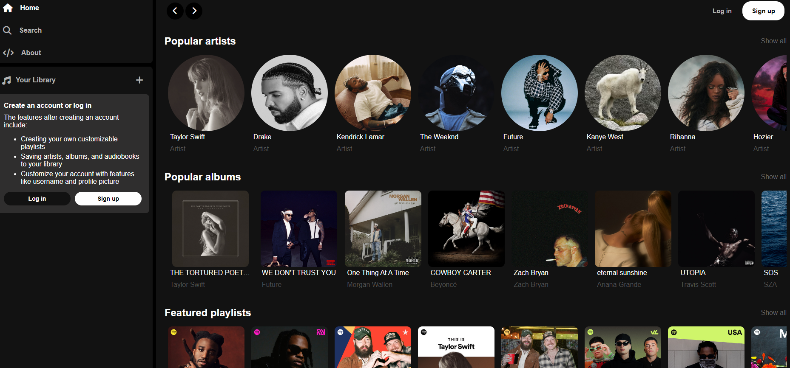

# Spotify Clone App

## Full stack application which clones the UI and essential backend features of Spotify using the MERN tech stack (MongoDB, Express, React, Node.js).

## Features
- Search for your favorite artists, albums, tracks, and playlists on Spotify.
- Create a user profile with customizable features such as the username and profile image.
- Create playlists consisting of tracks and audiobooks with customizable features such as the name, description and image.
- Follow your favorite artists, albums, playlists, and audiobooks to save them to your library.
- User authentication.
- Track your recently viewed music items.

## Technologies/Frameworks
- MongoDB
- Express
- React
- Node.js
- Tailwind
- Firebase (image hosting)
- Vercel (frontend hosting)
- Render (backend hosting)

## Future features
- Default playlist profile pic (quad collage)
- Sidebar collapse
